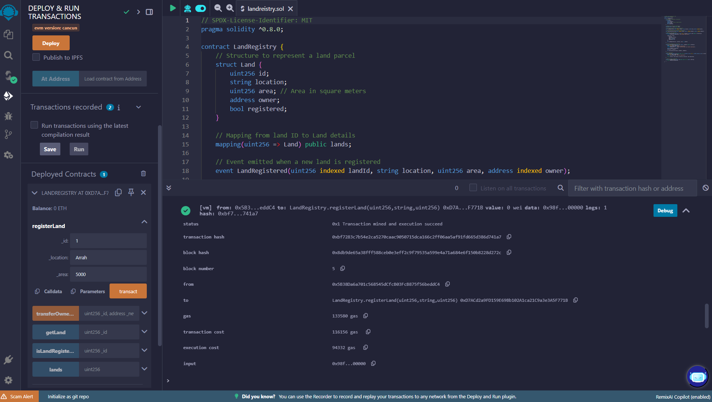
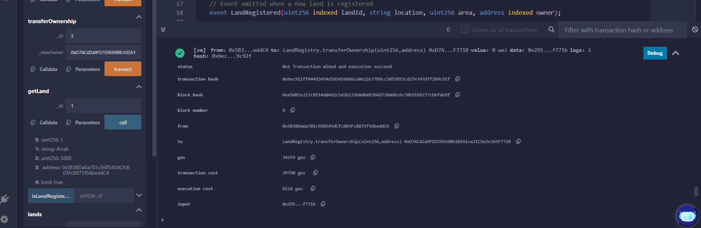
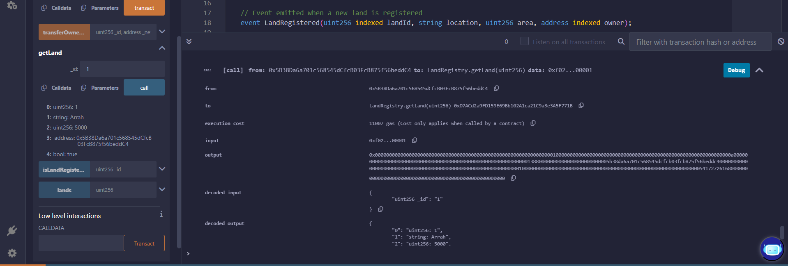
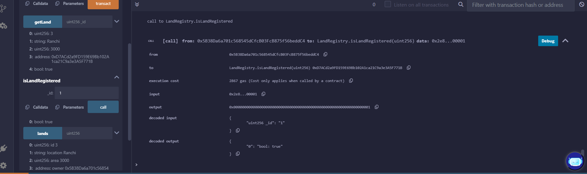

# Land Registry Smart Contract

## Overview
A decentralized land registry system built on Ethereum, enabling secure and transparent registration and transfer of land parcels. This smart contract allows users to register land details, transfer ownership, and verify land information on the blockchain.

## Features
- **Land Registration**: Register new land parcels with unique IDs, location, and area.
- **Ownership Transfer**: Securely transfer land ownership between Ethereum addresses.
- **Land Verification**: Check registration status and retrieve detailed land information.
- **Event Tracking**: Emit events for registration and ownership transfers for auditability.

## Installation
1. **Requirements**
   - Solidity compiler (v0.8.0 or higher)
   - Ethereum development environment (e.g., [Remix IDE](https://remix.ethereum.org/), [Hardhat](https://hardhat.org/))

2. **Deployment**
   - Compile and deploy the `LandRegistry.sol` contract to an Ethereum network (Mainnet, Testnet, or local node).

## Usage

### Register a Land Parcel



```solidity
// Call from the owner's address
registerLand(
    _id: 12345,
    _location: "Patna, India",
    _area: 500 // in square meters
);
```

### Transfer Ownership



```solidity
// Call from the current owner's address
transferOwnership(
    _id: 12345,
    _newOwner: 0x... // Recipient's address
);
```

### Retrieve Land Details



```solidity
(uint256 id, string memory location, uint256 area, address owner, bool registered) = getLand(12345);
```

### Check Registration Status



```solidity
bool isRegistered = isLandRegistered(12345);
```

## Events
- **LandRegistered**: Emitted when a new land is registered.
  ```solidity
  event LandRegistered(uint256 indexed landId, string location, uint256 area, address indexed owner);
  ```

- **OwnershipTransferred**: Emitted when ownership changes.
  ```solidity
  event OwnershipTransferred(uint256 indexed landId, address indexed oldOwner, address indexed newOwner);
  ```

## Testing
1. **Test Cases**
   - Registering a new land parcel.
   - Transferring ownership to another address.
   - Attempting to register a duplicate ID.
   - Unauthorized ownership transfer attempts.

2. **Tools**
   - Use testing frameworks like [Hardhat](https://hardhat.org/) or [Truffle](https://trufflesuite.com/).

Example Hardhat test snippet:
```javascript
it("Should register land", async () => {
  await landRegistry.connect(owner).registerLand(1, "Berlin", 1000);
  expect(await landRegistry.isLandRegistered(1)).to.be.true;
});
```
## Developer: Aman Kumar
